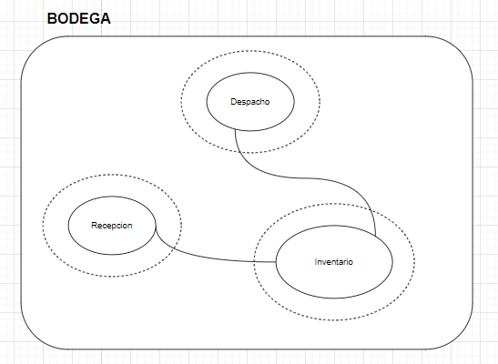
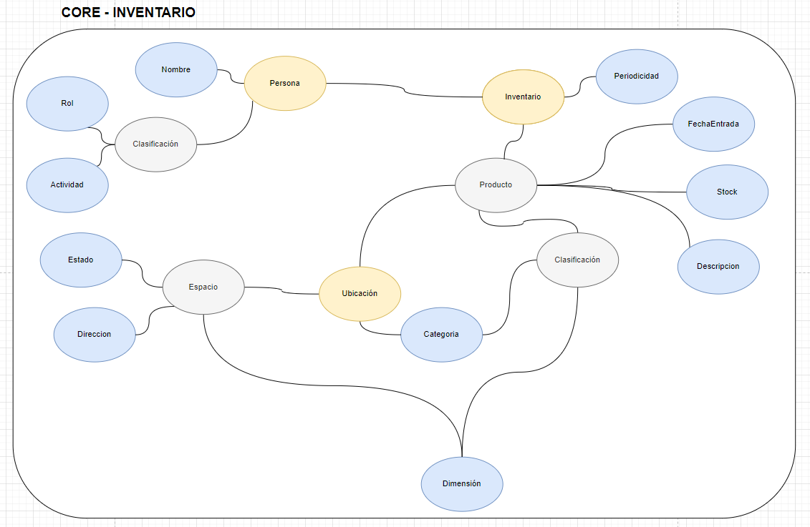
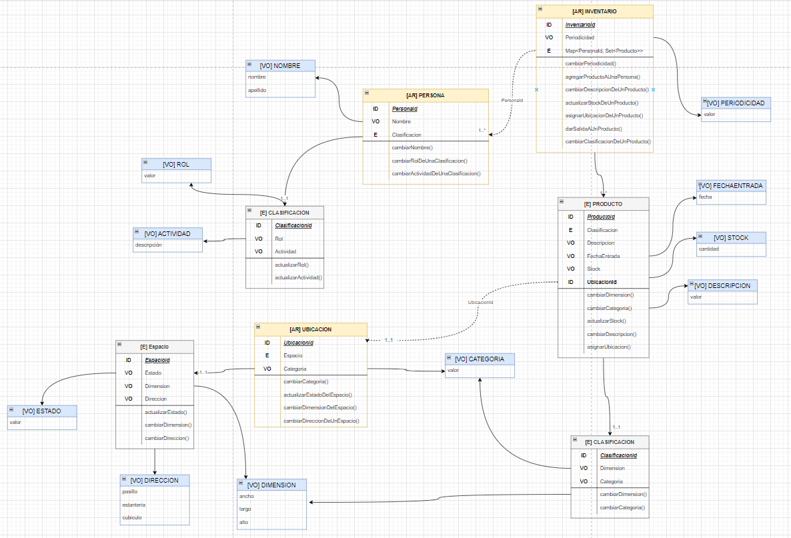
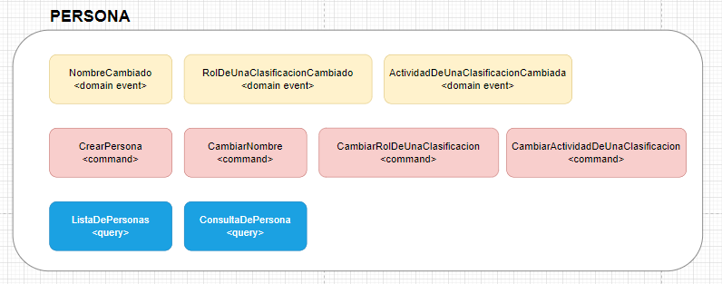
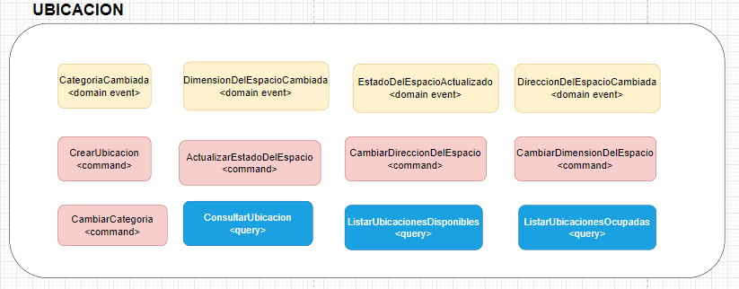
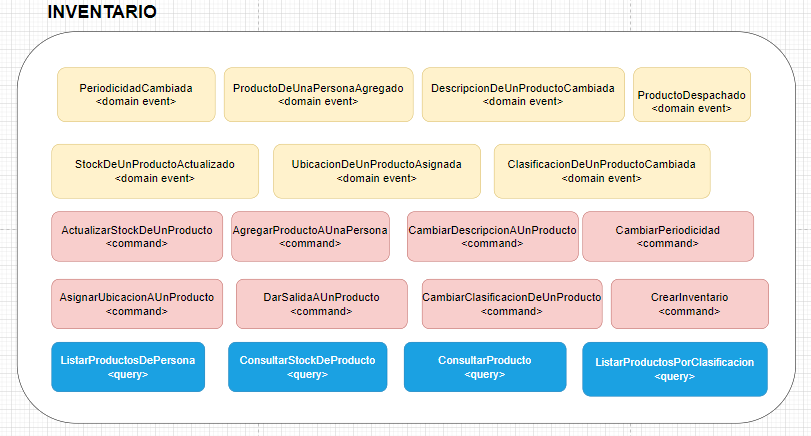

# Análisis del problema: Cuarta Pauta (Implementación)

## dominio-ddd-bodega

Se crea un pet project basado en el servicio de inventario de una bodega, se implemento la parte parte estrategica y tactica de dicho dominio.

### Artefactos

<ul>
<li>Análisis del problema (big piture y contexto delimitado seleccionado). </li>
<li>Modelo de dominio, con los agregados, comportamientos, entidades y objetos de valor.</li>
</ul>

### Link del diagrama del dominio

https://drive.google.com/file/d/1rl_guvE7pfXtkioQ09bFbJCIHkXN16zn/view?usp=sharing

## Análisis 

## Modelo de dominio

## Eventos

### Integrantes

<strong>Josué David Ardila Parra   
Steven Calderon Guzman  
<strong>Sebastian Pineda Romero </strong>